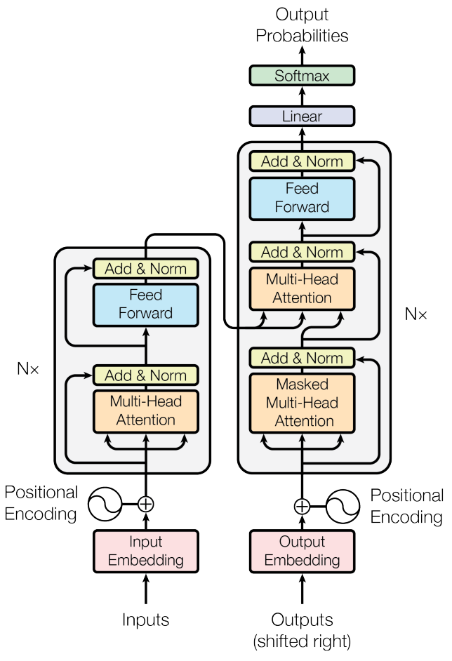
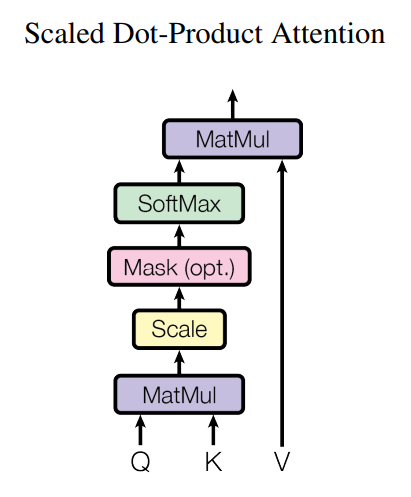
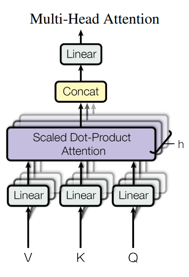
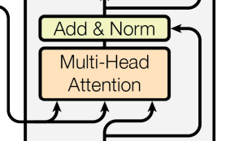
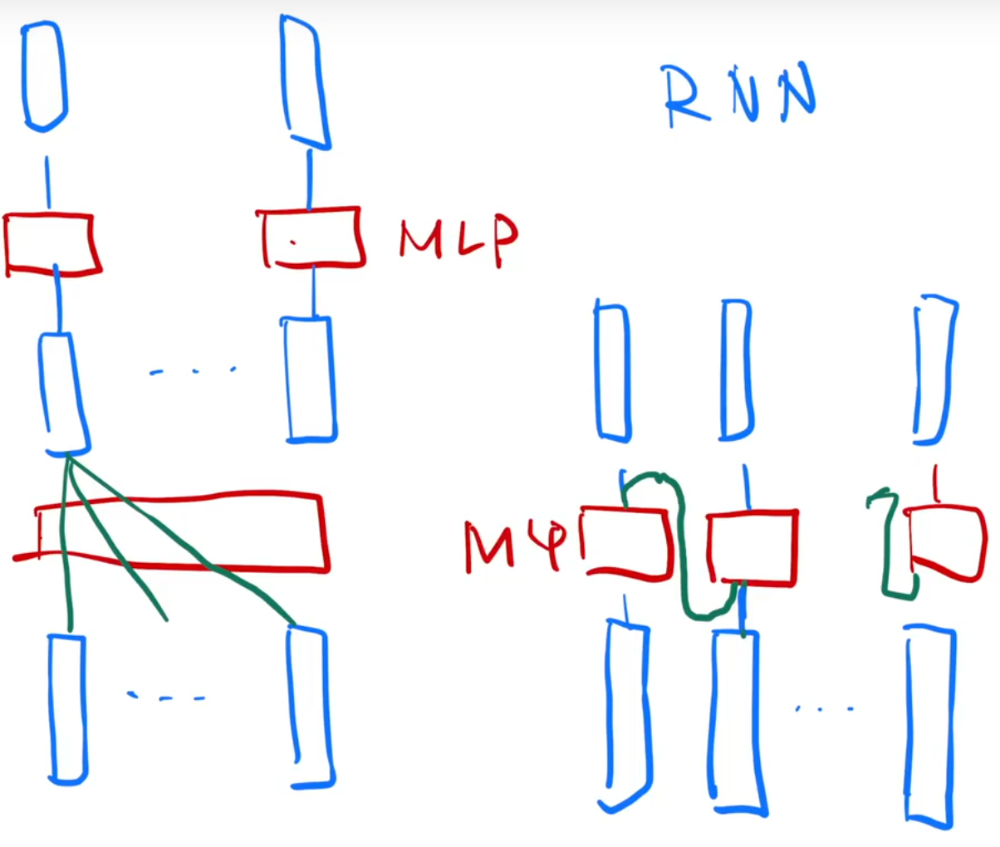
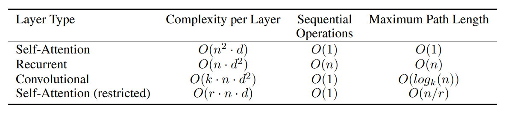

# 引言

传统的seq2seq依赖使用encoder-decoder结构的RNN,CNN，在encoder-decoder之间会使用注意力机制

- **RNN**：对第t个向量，计算它的隐藏状态ht，ht是由ht-1和当前向量决定，这样可以将前面学到的信息通过隐藏状态ht-1传递到当前

  - 从左往右一步步走，时序过程，难以并行

  - 如果时序比较长，早期的信息在后面可能会丢失，如果不想丢失，就得设置比较大的ht，但每一个时间步都要存储ht，比较占内存

- **Attention**：attention之前就被用在encoder-decoder结构中
  - 主要关注于怎么把encoder的输出有效的传递到decoder中

**Transformer只是一个更简单的架构（simple） ，不使用循环和卷积，只使用了纯注意力机制**

- 将recurrent layers替换成multi-headed self-attention
- 更快，完全并行

> 一开始的Transformer只针对机器翻译领域

# 背景

## CNN

使用CNN替换RNN减少时序的计算，但CNN对比较长的序列难以建模

- 使用卷积核每次看一个比较小的窗口
- 如果两个像素隔得比较远，要卷很多层

CNN的优点是可以有多个输出通道，每个输出可以看成识别的不一样的模式

所以提出multi-headed self-attention，用多头来模拟CNN的多输出通道

## memory networks

# 方法

## Encoder-Decoder

**编码器-解码器架构**

- Encoder将原始的输入表示为机器学习可以理解的一组向量
  - 将input序列x=(x1,x2,x3,x4,...,xn)映射成一组向量序列z=(z1,z2,z3,z4,...,zn)
- Decoder根据向量序列z=(z1,z2,z3,z4,...,zn)生成y=(y1,y2,y3,y4,...,ym)
  - 自回归一个个生成yi
  - 过去时刻的输出也会当成当前时刻的输入 

## Encoder

6 layers：2sub-layers

- Multi-Head Attention
- MLP：positionwise fully connected feed-forward network

`LayerNorm(x+Sublayer(x))`

因为残差连接需要一样的大小，否则要做投影，所以规定每一个layer的输出维度（dimension）dmodel = 512

所以超参数只有2个

- 多少层layer
- 多少个维度dmodel

## Layer Norm

二维输入：矩阵

- 每一行：样本x
- 每一列：特征f

> 一个batch就是一个二维矩阵（一个正方形）

**Batch Norm**

Batch Norm是**每一次将一列向量（一个特征）在一个batch中，均值变为0，方差变为1**

- 将向量本身的均值减去向量的均值，再除以向量的方差 
- 训练的时候是在一个小batch中计算
- **预测的时候需要计算一个全局的均值和方差使用**
  - 因为是所有样本的特征来计算

> Batch Norm还会学习两个参数，λ和β。将一个向量表示为任意的均值和方差

**Layer Norm**

Layer Norm是**每一次将一行向量（一个样本）在一个batch中，均值变为0，方差变为1**

- 可以认为是将向量转置后使用Batch Norm然后变换后再转置回来就得到结果
- **不需要全局的均值和方差，因为计算是针对每一个样本的**

但在**Transformer中，输入的一个序列样本是三维的**

- 每一个序列样本里面有很多元素，每个元素对应一个长度的向量

三维的信息

- 长：一个长度为n的seq
- 宽：元素对应的一个长为d=512的向量
  - 每一个维度就是一个特征
- 高：batch_size

如果选取Batch Norm，每一次取一个特征，即所有序列的所有元素对应向量的一个维度

- 就是对应**竖着切**正方体的一个切面：一个正方形
- **将这个面拉直成一条直线**，将其均值变为0，方差变为1

如果选取Layer Norm，每一次取一个样本，即一个序列的所有元素对应向量的所有维度

- 就是对应**横着切**正方体的一个切面：一个正方形
- **将这个面拉直成一条直线**，将其均值变为0，方差变为1

> 不同的切法带来不同的结果

**为什么在变长的序列中不使用batch norm**

因为时序的模型中，每个样本的长度可能不一样（补0填充），所以不同的切法得到的结果不一样，计算均值和方差也不一样

- 所以如果不同的序列长度变化比较大，batch norm每次计算均值和方差抖动就比较大

- 做预测时要计算全局的均值和方差，如果新预测的样本长度更大，与之前训练的序列长度差距较大，那么之前算的均值和方差的效果可能就不好
- 而Layer Norm是在给每个样本计算均值和方差，没有太大影响

## Decoder

6 layers：3sub-layers

- Multi-Head Attention
- MLP：positionwise fully connected feed-forward network
- **masked multi-attention**

**使用自回归来做预测时，当前的输入集是上一个时刻的输出。不应该看到之后那些时刻的输出，但是注意力机制每次都是看到整个完整的输入**

- 所以通过一个**带掩码的注意力机制**，来避免**训练的时候**解码器预测第t个时刻的输出的时候看到t时刻后面的输出
- 从而保证训练和预测的行为是一致的  

## Attention

注意力层

> An attention function can be described as mapping a query and a set of key-value pairs to an output, where the query, keys, values, and output are all vectors. The output is computed as a weighted sum of the values, where the weight assigned to each value is computed by a compatibility function of the query with the corresponding key.

注意力函数是将一个query向量和一些key-value向量对映射成一个输出的函数

- 输出就是value向量的一个加权和，所以输出的维度和value的维度相同
- 对每一个value向量的权重，是value向量对应的key向量和query向量相似度计算得出
  - **相似度对于不同的注意力机制有不同的计算结果**
  - 所以相同的key-value，对不同的query会得出不同的结果

### Scaled Dot-Product Attention

Transformer使用的是**Scaled** Dot-Product Attention（最简单的注意力机制），使用内积做计算，**内积值越大，相似度越高**

$Q_{n×d_k}$，$K_{m×d_k}$，$Q×K = A_{n×m}$，$V_{m×d_v}$，$A×V = A'_{n×d_v}$

- query向量和key-value向量对的个数可能是不一样的，
- query向量和key向量长度都是相同的，等于dk
- value向量的长度是dv，即输出长度也是dv

**缩放因子**

Layer Norm后向量的维度等会$\sqrt{d_k}$，所以除以$\sqrt{d_k}$

- 当$d_k$不是很大的时候，无所谓
- 当$d_k$很大（512）的时候，即两个向量比较长的时候，点积的结果值就会比较大（或者比较小）
  - **当点积值比较大的时候，相对的差距就会变大**，则最大的哪个值在softmax后就会更接近于1，剩下的值就会更加接近于0
- 这时候算梯度就会非常的小，跑不动

> 因为softmax的最后结果是希望预测值，置信的地方尽量靠近1，不置信的地方尽量靠近0，这样就差不多收敛

$A'_{n×d_v}$的每一行就是所需要的输出

- 然后对结果的每一行做softmax，每一行之间是独立的

### Msasked

**问题**

- query向量和key向量长度都是相同的，且在时间上是可以对应起来的

- 对于$query_t$，应该只看到$key_1$到$key_{t-1}$部分的内容，而不应该看到$key_t$和之后的内容

- 注意力机制每次都会看到所有的内容，从$key_1$到$key_n$

所以通过一个**带掩码的注意力机制**，来避免**训练的时候**解码器预测第t个时刻的输出的时候看到t时刻后面的内容

- 仍然会全部计算出k1到kn的内容
- 使用mask操作， 对于t时刻的$query_t$和$key_t$和之后的计算值，换成非常大的负数
  - 这样在进行softmax归一化时，对应的权重值就会变成0
- **从而保证训练和预测的行为是一致的**   

### Multi-Head Attention

与其做一个单个的attention

1. 不如将query向量和key-value向量对投影到一个低维的空间，然后做h次的attention
   1. layer层就是投影到低维度
   2. 有几个头就是几次
2. 然后将h次的attention的输出合并，再投影回高维的空间得到最终输出
   1. 即将h个头的输出合并
   2. concat层就是最后的投影

**目的**

- Dot-Product Attention没有什么可以学的参数，具体函数就是内积
- 有时候为了识别不一样的模式，希望有一些不一样的计算方法
- **所以先让query向量和key-value向量对投影到一个低维的空间，这个对应的线性变换的W矩阵是可以学的**
- **给了h次机会（h个头），希望能学到不一样的投影的方法，使得在投影进去的那个度量空间中能匹配不同的模式** 

### Self-Attention

输入的query向量和key-value向量对其实是一个东西变换而来，所以叫自注意力机制

> 对应架构图中input embedding进过position encoding后变成三个输入

### Encoder-Decoder传递Attention

连接的attention层不再是自注意力层

- 编码器Encoder的输出作为key向量和value向量传入解码器Decoder中
- 解码器Decoder的masked attention的输出作为query向量和编码器Encoder的输入key向量和value向量一起作为输入

由于attention层的输出结果是value向量的加权后，所以连接的attention层的输出就是编码器传入的value向量的加权和

- 权重就由解码器的query向量和编码器的key向量得出
- 即取决于解码器的query向量和编码器的key向量的相似度

> 根据解码器的不一样，会在当前编码器输出的中挑选相似的东西

## Feed Forward NetWorks

**Position-wise Feed-Forward Networks**

- a fully connected feed-forward network
- 编码器和解码器的每一层都含有一个FNN

**Position-wise**

- attention层输出是一个序列，其中每一个向量就是一个position，将这个相同的MLP对每一个向量作用一次

$$
FFN = max(0,xW_1+b_1)W_2+b_2
$$

其中

- $xW_1+b_1$是一个线性层
- $max(0,xW_1+b_1)$是一个ReLU激活层
- $max(0,xW_1+b_1)W_2+b_2$是另一个线性层

因为attention层的每一个输出都是一个512的向量

- 所以$x$就是一个512维的向量

- 然后$W_1$会将$x$投影成一个2048维度的向量
- 由于有残差连接，所以最后还需要有$W_2$去将2048维度的向量投影回512维度

**就是一个单隐藏层的MLP，中间的隐藏层将输入扩大4倍，最后的输出层再缩小回去**

- 

因为在经过attention层处理后，每一个输出的向量已经抓取出序列中所想要的信息了

- **所以在经过MLP做投影的时候，因为每一个向量已经包含所需的信息，每个MLP只要在对每个单独的向量独立做运算就可以了**

> 做空间转换

**RNN和Transformer区别**

## Embeddings and Softmax

输入是一个个token，需要将其映射成一个向量

- Embedding就是给任意一个token，**学习将一个长为d=512的向量来表示它**
- 编码器和解码器的输入都要经过一个Embedding，softmax前面也需要一个Embedding
  - 并且这三个Embedding的权重是一样的，方便训练
- 权重还会乘以一个$\sqrt{d}$，即$\sqrt{512}$
  - 因为在学习Embedding的时候可能会将一个向量的L2L学成一个相对比较小的值，比如1，即不管维度多大，最后值都等于1
  - 维度一大，权重值就会变小，但是Embedding后还需要加上Positional Encoding的向量，所以将权重乘以$\sqrt{d}$后使得两者的维度差不多

## Positional Encoding

attention是不会有时序信息的

- 输出是value向量的加权和，权重是query向量和key向量的距离（相似度），都与序列位置信息无关
- 所以给定一个序列，将其中的向量位置打乱，得出的结果顺序会变，但是值是不会变的

> RNN本身就是一个时序的处理，将上一个时刻的输入作为下一个时刻的输出

因为输入序列无论怎么打乱顺序，输出值是一样的，所以选择**在输入值里面直接加入时序信息的值**

- attention的输入是在嵌入层表示的一个d=512长度的一个向量
- 所以现在依旧使用一个d=512长度的一个向量来表示一个数字，**代表向量的位置**

> 因为计算机一个数字可以认为是一个**长度为32位的向量**来表示的

将**这两个向量相加就表示加入了时序数据的输入**

- 因为Positional Encoding的函数是一个cos和sin的函数，所以它的值是在-1和+1之间抖动的
- 所以将结果乘以一个$\sqrt{d}$，所以每个位置数字也差不多在-1和+1之间抖动

# 优点

- 计算复杂度
- 顺序的计算：越少越好，越少并行度越高
- 信息从一个数据点走到另一个数据点要走多远：越短越好

> n个维度为d的query
>
> - n：序列长度
> - d：向量长度

Self-Attention (restricted) 

- query只和最近的r个key做计算
- 距离比较远的两个点需要走几步才能过来

没有太多东西可以调参

- $N$是多少层
- $d_{model}$是token表示成的向量的长度
- $h$是指有多少个头

