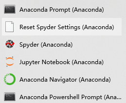
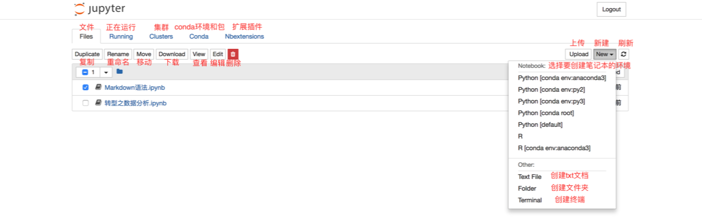
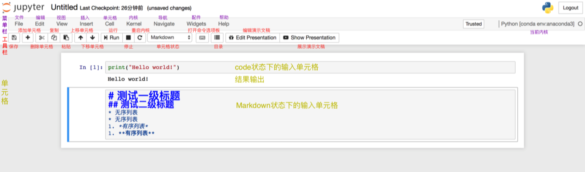
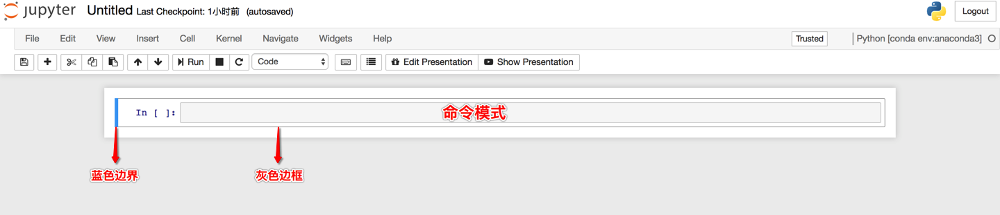
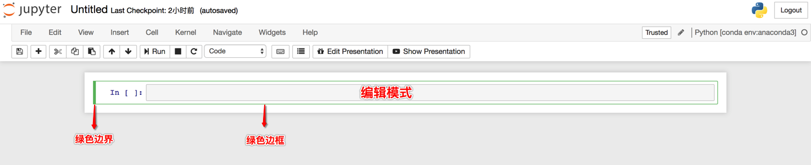
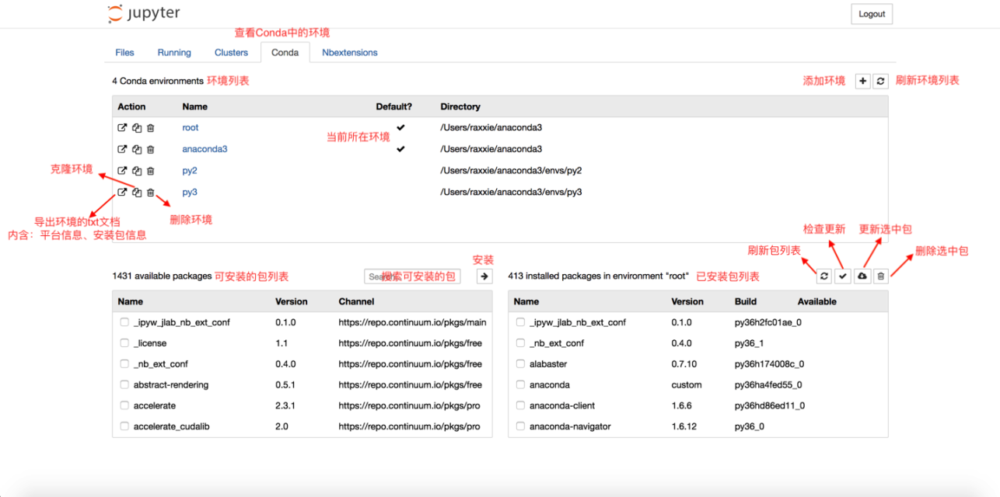

# Anaconda

[Anaconda | The World's Most Popular Data Science Platform](https://www.anaconda.com/)

[anaconda | 清华大学开源软件镜像站](https://mirror.tuna.tsinghua.edu.cn/help/anaconda/)

Anaconda是一种为**科学计算**而生的Python发行版

- 一个基于Python的数据处理和科学计算平台，内置了许多非常有用的第三方库

- **Anaconda会把系统Path中的python指向自己自带的Python**
- Anaconda安装的第三方模块会安装在Anaconda自己的路径下，不影响系统已安装的Python目录

Anaconda包括

- 标准的python环境
- conda（包和环境管理器）
- 科学包以及依赖项

> **conda**： 开源包管理系统和环境管理系统，支持Python, Java, C/C++ 等多种语言，支持Windows, macOS 和 Linux 上运行
>
> **pip**：官方包管理器，推荐用于安装Python包索引（`PyPI`）上发布的包
>
> **virtualenv**：环境管理器

 

> 安装完需要添加环境变量

## conda环境管理

```python
# 查看当前已安装的环境
conda info -e　　　　　　　　　　
# 创建Python环境
conda create -n ink python=3.6　
# 切换环境
conda activate ink
# 返回默认环境
conda deactivate 
# 删除已创建的Python环境
conda remove -n ink --all
```

## conda包管理

```python
# 查看当前环境下已安装的包
conda list　　　　　
查看指定环境下已安装的包
conda list -n ink　　　
# 查找package的信息
conda search selenium　　　　　　　 
# 在指定环境安装package，不加-n则安装在当前环境
conda install -n ink scikit-learn
# 指定环境更新package，不加-n则更新在当前环境
conda update -n ink scikit-learn
# 指定环境删除package，不加-n则删除在当前环境
conda remove -n ink scikit-learn
```

**conda将conda、python等都视为package**，因此可以使用conda管理conda和python的版本

```python
# 更新conda
conda update conda 　 
# 更新anaconda
conda update anaconda 
# 更新python，假设当前环境是3.6，则更新3.6.x系列版本
conda update python  
```

anconda的**默认环境**会安装anconda的包集合

新添加的python环境只会安装相关的必须项，如python、pip等

```python
# 在当前环境下安装anaconda包集合
conda install anaconda 　　　　　　　　　　
# 在创建环境的同时安装anaconda集合包
conda create -n ink python=3.6 anaconda 　　 
```


# Jupyter Notebook

Jupyter Notebook是基于网页的用于交互计算的应用程序。被应用于全过程计算：开发、文档编写、运行代码和展示结果，可以直接通过浏览器运行代码，在代码块下方展示运行结果

> 以前叫ipython notebook

**组成部分**

- 网页应用
  - 可以实现各种功能的工具
  - 基于网页形式的、结合了编写说明文档、数学公式、交互计算和其他富媒体形式的工具

- 文档
  - Jupyter Notebook中所有交互计算、编写说明文档、数学公式、图片以及其他富媒体形式的输入和输出，都是**以文档的形式体现**的
  - 文档保存为后缀名为`.ipynb`的`JSON`格式文件（也可以导出为HTML、LaTeX、PDF等格式）


## 安装

### Anaconda安装

Anaconda自动安装了Jupter Notebook及其他工具，还有python中超过180个科学包及其依赖项

如果没有安装anaconda包，就需要自己安装

```bash
conda install jupyter notebook
```

### pip安装

**把pip升级到最新版本**

```bash
# Python 3.x
pip3 install --upgrade pip

# Python 2.x
pip install --upgrade pip
```

**安装Jupyter Notebook**

```bash
# Python 3.x
pip3 install jupyter
# Python 2.x
pip install jupyter
```

## 运行

在终端中输入`jupyter notebook`，**默认启动端口：8888**

- 执行命令之后终端中将会显示一系列notebook的服务器信息，同时浏览器将会自动启动Jupyter Notebook
- 如果同时启动了多个Jupyter Notebook，由于默认端口8888被占用，因此地址栏中的数字将从8888起，每多启动一个Jupyter Notebook数字就加1（8889，8890......）
- 在Jupyter Notebook的所有操作都要**保持终端不要关闭**

> `ERROR: the notebook server could not be started because no available port could be found.`
>
> 可能出现端口被占用的情况，此时可以指定端口启动

```bash
# 默认启动
jupyter notebook

# 指定端口号启动
jupyter notebook --port port_number

# 启动服务器但不打开浏览器
jupyter notebook --no-browser
```


## 修改配置文件

**修改Jupyter Notebook的文件存放路径**

1. **创建目录后复制目录路径**

2. **获取配置文件所在路径**

   ```bash
   jupyter notebook --generate-config
   ```

   这条命令可以用于查看配置文件所在的路径，但主要用途是**是否将这个路径下的配置文件替换为默认配置文件**

   > 若文件已经存在或被修改，使用这个命令之后会出现询问"用默认配置文件覆盖此路径下的文件吗？"，按`y`则完成覆盖（之前所做的修改都将失效）
   >
   > 如果只是为了查询路径，那么一定要输入`N`

   

   一般情况下，**配置文件所在路径和配置文件名**如下：

   - Windows：`C:\Users\user_name\.jupyter\`
   - Linux/macOS：`/Users/user_name/.jupyter/` 或 `~/.jupyter/`
   - 配置文件名：`jupyter_notebook_config.py`

   > `.`开头的目录是隐藏文件，通过`ls -a`命令查看

3. **修改配置文件**

   1. **打开配置文件**

      ```bash
      vim ~/.jupyter/jupyter_notebook_config.py
      ```

   2. **查找关键词**

      输入`/c.NotebookApp.notebook_dir`（`/`符号和关键字`c.NotebookApp.notebook_dir`），再回车，光标切换到文中被关键词首字母

   3. **编辑配置文件**

      光标定位在第二个单引号上（光标定位在哪个字符，就在这个字符前开始输入），把复制的路径粘贴在此处

   4. **取消注释**

      把该行首的`#`删除。

      > 因为配置文件是Python的可执行文件，在Python中`#`表示注释，编译过程中不会执行该行命令，所以为了使修改生效，需要删除`#`

4. 验证

   在终端中输入命令`jupyter notebook`重新打开Jupyter Notebook


## 使用

现有的文件可以通过勾选文件的方式，对选中文件进行复制、重命名、移动、下载、查看、编辑和删除

也可以根据需要，在`New`下拉列表中选择想要创建文件的**环境**

> 右上角`new`中的python版本和anaconda的版本有关，下载python3就是python3
>
> 新建python3后右上角会显示python3

## Files



### 笔记本



**笔记本重命名**

- 在左上方Jupyter的图标旁有程序默认的标题`Untitled`，点击`Untitled`在弹框中输入标题即可修改
- 在`Files`界面勾选需要重命名的文件，点击`Rename`输入标题即可修改

 

**笔记本的两种模式**

1. **命令模式**

   按`esc`进入命令模式

   - 将**键盘命令**与Jupyter Notebook**笔记本命令**相结合，可以通过不同键的组合运行笔记本的命令
   - 命令模式下**单元格边框为灰色，左侧边框线为蓝色粗线条**

   

2. **编辑模式**
   按`enter`进入编辑模式

   - 编辑模式使用户可以在单元格内编辑代码或文档
   - 编辑模式下**单元格边框和左侧边框线均为绿色**
   
   

### 单元格

中间部分称为**单元格**

- 退出本单元格（退出编辑）：`esc`
- 单元格中换行：`enter`
- 执行单元格
  - 执行本单元格：`ctrl+enter`
  - 执行本单元格并向下建立一个新的单元格：`shift+enter`
  - 点击**运行**按钮
- 选中单元格操作
  - 在上方加一个空白单元格：`a`
  - 在上方加一个空白单元格：`b`
  - 删除本单元格：`dd`
- 标记：修改为标记格式，前面`In`消失，可以输入代码注释，运行即可
- 按`Tap`可以自动补全
- 在代码后加上`？`，然后按`shift+enter`可以查看提示信息


## Running

`Running`页面主要展示的是当前**正在运行当中的终端**和**`ipynb`格式的笔记本**

若想要关闭已经打开的终端和`ipynb`格式的笔记本，仅仅关闭其页面是无法彻底退出程序的，需要在`Running`页面点击其对应的`Shutdown`按钮

## Conda

Conda页面主要是Jupyter Notebook与Conda关联之后对**Conda环境和包**进行直接操作和管理的页面工具



## Nbextension

Nbextensions页面提供了多个Jupyter Notebook的插件

主要使用的插件有nb_conda，nb_present，Table of Contents(2)（为Markdown文档提供目录导航）


## 加载网站源代码

在Jupyter Notebook的单元格中直接**加载指定网站的源代码**

```bash
# URL为指定网站的地址
%load URL
```


## 加载本地Python文件

在Jupyter Notebook的单元格中**加载本地的Python文件并执行文件代码**

- 第一次执行：将本地的Python文件内容加载到单元格内。Jupyter Notebook会自动将`%load`命令注释掉（#），以便在执行已加载的文件代码时不重复执行该命令
- 第二次执行：执行已加载文件的代码

```bash
%load Python文件的绝对路径
```


## 直接运行本地Python文件

不在Jupyter Notebook的单元格中加载本地Python文件，而是**直接运行本地Python文件**

> `!python3`和`!python`属于 `!shell命令` 语法，即在Jupyter Notebook中执行shell命令的语法（在单元格中用英文感叹号`!`后接shell命令即可执行shell命令）
>
> 执行过程中将不显示本地Python文件的内容，直接显示运行结果

```bash
%run Python文件的绝对路径

# 执行Python 3.x版本的代码
!python3 Python文件的绝对路径

# 执行Python 2.x版本的代码
!python Python文件的绝对路径
```


## 获取当前位置

在Jupyter Notebook中获取当前Jupyter Notebook中创建的**笔记本所在位置**的**绝对路径**

```bash
%pwd
!pwd
```


## 关闭笔记本和终端

想要退出终端或笔记本时，**关闭页面**是无法结束程序运行的

需要通过以下步骤将其完全关闭

1. 关闭笔记本（无法关闭终端）
   1. 进入`Files`页面
   2. 勾选想要关闭的`ipynb`笔记本
      - 正在运行的笔记本图标为绿色，后边标有`Running`
      - 已经关闭的笔记本图标为灰色
   3. 点击上方的黄色的“Shutdown”按钮
   4.  成功关闭笔记本
2. 关闭笔记本和终端
   1. 进入`Running`页面
      1. 第一栏是`Terminals`，即所有正在运行的终端
      2. 第二栏是`Notebooks`，即所有正在运行的`ipynb`笔记本
   2. 点击想要关闭的笔记本或终端的`Shutdown`按钮
   3. 成功关闭笔记本或终端


## 退出Jupyter Notebook

仅通过关闭网页是无法退出Jupyter Notebook的，因为打开Jupyter Notebook其实是启动了它的服务器

想要彻底退出Jupyter Notebook需要关闭它的服务器

需要在它启动的终端上按：

- Mac：`control c`
- Windows：`ctrl c`

> 终端上会提示："Shutdown this notebook server (y/[n])?" 
>
> 输入`y`即可关闭服务器，退出Jupyter Notebook


# Pandas

`import pandas as pd` 

数据统计包

- **pandas依赖于numpy**

## DataFrame

`from pandas import DataFrame`

- pandas中的一种**表格型数据结构**
- 含有一组有序的列，每列可以是不同的值
- 既有**行索引（index）**，也有**列索引（columns）**

> 潜在的列是不同的类型
>
> 可以看作是由Series组成的字典，不过这些Series公用一个索引

## 创建DF

`pandas.DataFrame(data, index, columns, dtype, copy) `

```python
# 列表创建
import pandas as pd
df = pd.DataFrame()

data = [1,2,3,4,5]
df = pd.DataFrame(data)

data = [['Alex',10],['Bob',12],['Clarke',13]]
df = pd.DataFrame(data,columns=['Name','Age'])

# 字典创建
import pandas as pd
data = {'Name':['Tom', 'Jack', 'Steve', 'Ricky'],'Age':[28,34,29,42]}
df = pd.DataFrame(data)
```

##  查看数据

- `head()`：读取df的前五行数据

- `tail()`：读取df的后五行数据

## 数据选取

### 行列选取

**选择行**

- 行数切片：**前闭后开**，`df[0:1]`
- 行索引名切片：**前闭后闭**，`df[:'a']`，`df['a':'b']`
- 布尔选择：`df[[True,True,True,False,False,False,False,False,False,False]]`
- 表达式选择：`df[[row >30 for row in df['col']]]`

> 布尔数组长度要和数据集长度匹配

**选择列**

- 列索引名选择：`df['col']`，`df['col1','col2']`

### 区域选择

从多个维度（行和列）对数据进行筛选

- `df.loc()`：标签索引

  - 只能使用**字符型标签来索引数据**，**不能使用整数索引**，前闭后闭

  > 使用`loc()`时要判断标签的数据类类型，当DataFrame的行标签或者列标签为数字可以来其来索引

- `df.iloc()`：整数索引
  - **只能使用整数索引**，**不能使用字符型标签索引**，前闭后开

> 如果只有一个参数，那么默认是行

```python
# 选取索引为‘a’的行
df.loc['a', :]
# 选取索引为‘a’或‘b’或‘c’的行
df.loc[['a','b','c'], :]
# 选取从‘a’到‘d’的所有行
df.loc['a':'d', :]
# 选取所有age大于30的行
df.loc[df['age']>30,:]
# 选取name列
df.loc[:, 'name']
# 同时对行和列进行筛选
df.loc[df['age']>30,['name','age']]

# 选取第2行
df.iloc[1, :]
# 选取前3行
df.iloc[:3, :]
# 只有一个参数，默认第三行
df.iloc[2] 
# 第一行和第三行
df.iloc[[0,2]]
# 布尔数组
df.iloc[:,[True,False,True]]
# 选取第1列的1-4行
df.iloc[1:5,1]
# 选取第1列，第3列和第4列
df.iloc[:, [0,2,3]]
# 选取10-20行的所有列的数据
df.iloc[10:20,:] 

# 选取第3行的name列
df.ix[2,'name']
# 选取a行，c行的第1列，第2列和第4列数据
```

### 单元格选择

选取的都是单个单元格（单行单列），所以返回值都为基本数据类型

- `df.at[]`：只能使用字符型标签索引
- `df.iat[]`：只能使用整数索引

> 使用时必须输入两个参数，即行索引和列索引

```python
df.at['b','name']
df.iat[1,0]
```


## 随机抽样

对数据集进行随机抽样：**从DataFrame中随机选择行和列**

`DataFrame.sample(n=None, frac=None, replace=False, weights=None, random_state=None, axis=None)[source]`

- `frac`：抽取行的比例
- `replace`：可不可以重复选 
- `random_state`
  - `int`：随机数发生器种子 
  - `numpy.random.RandomState`
- `axis`：选择抽取数据的行还是列
  - axis=0：抽取行
  - axis=1：抽取列 


## 数据赋值

`copy()`：复制object的**索引和数据**

`DateFrame.copy(deep=True)` 

- 当`deep=True`时（默认） 会创建一个新的对象进行拷贝，修改这份拷贝**不会对原有对象产生影响**
- 当deep=False时，新的对象只是原有对象的references，任何对新对象的改变**都会影响到原有对象**

## ewm函数

**指数加权平均计算**：这个指标可以较好反应**指数变动的趋势**

**指数移动平均值EMA**（Exponential Moving Average）：也叫EXPMA指标，是一种趋向类指标，EMA是以指数式递减加权的移动平均

> 递归计算：EMA（today）=α * Price（today） + ( 1 - α ) * EMA（yesterday）
>
> 其中
>
> - α为平滑指数，一般取作2/(N+1)。在计算MACD指标时，EMA计算中的N一般选取12和26天，因此α相应为2/13和2/27
> - 递归终点一般取EMA(0) = Price

`DataFrame.ewm(com=None, span=None, halflife=None, alpha=None, min_periods=0, adjust=True, ignore_na=False, axis=0, times=None)`

- `com`：float，可选参数，定义有关质心的衰减参数
  - 简单的说是用来**定义α的一种方式**： α=1/(1+com)，com≥0
- `span` : float，可选参数，定义有关时间窗口的衰减参数
  - 简单的说是用来**定义α的一种方式**， α=2/(span+1)，span≥1
- halflife：float，可选参数，定义半生命周期的的衰减参数

- `alpha`：float，可选参数，**指定平滑因子α**，0≤α≤1
- `min_periods`：int，默认为0，**表示窗口期取数的最小数量**
- `adjust`：bool，默认为True，决定平滑因子的计算方式
- `ignore_na`：bool，默认为False，是否在加权计算中**忽略Nan的值**
  - 默认False表示权重基于绝对位置，不忽略Nan的值，只是不处理而已
  - 默认True表示权重计算基于相对位置，忽略Nan的值
- `axis`：分别代表是行（0）还是列（1），默认为行（0）

> 关系α因子的参数，包括com、span、half-life和 alpha 只能选一个，而且必须选一个

## 缺失值处理

在pandas中**空值和缺失值是不同的**

- 空值：`" "`
- 缺失值
  - DataFrame（数据帧）中，缺失值可以表示为`nan`或者`naT`（缺失时间）。
  - Series中，缺失值可以表示为`none`或者`nan`

### 生成缺失值

- `pd.NaT`
- `np.nan`

### 判断缺失值

- `df.isnull()`：生成所有数据的bool矩阵

  - 该位置为缺失值返回True

  - 该位置不为缺失值返回False


- `df.isnull().any()`：判断哪些**列**存在缺失值

```python
# 只显示存在缺失值的行列
df[df.isnull().values==True]

# 判断某一列是否全部为空
for col in range(df.shape[1]):
    print(df.iloc[col].isnull().all())
```

### 删除缺失值

`dropna`

在遇到某列数据（标签或指标等）大量丢失时，通常将该含有过多空值的行/列删除，使用dropna函数

`DataFrame.dropna(axis=0, how='any', thresh=None, subset=None, inplace=False)`

- `axis`：维度，，默认为0
  - 0表示行（index）
  - 1表示列（col）
- `how`
  - `"all"`：表示这一行或列中的元素全部缺失才删除这一行或列
  - `"any"`：表示这一行或列中只要有元素缺失就删除这一行或列
- thresh：表示这一行或列中至少有thresh个非缺失值才删除
- subset：在某些行或列的子集中选择出现缺失值的列删除，不在子集中的含有缺失值得列或行则不会删除
- inplace：筛选过缺失值的新数据是存为副本还是直接在原数据上进行修改。默认是False，即创建新的对象进行修改，原对象不变

> `df.dropna()`：所有的默认参数：删除行，只要有空值就会删除，不替换

### 填充缺失值

`fillna`

`DataFrame.fillna(value=None, method=None, axis=None, inplace=False, limit=None, downcast=None, **kwargs)`

- `value`：用什么值去填充缺失值
- `axis`：确定填充维度，从行开始或是从列开始
- `method`：填充缺失值所用的方法
- `limit`：确定填充的个数，只填充limit个缺失值

**填充方法**

对于`method`参数

- `ffill`：用缺失值**前面的一个值代替缺失值**
  - axis =1，横向的前面的值替换后面的缺失值
  - axis=0，上面的值替换下面的缺失值
- `bfill`：用缺失值后面的一个值代替缺失值
- `backfill`：用缺失值后面的一个值代替缺失值

## 读取csv文件

- 文件读取时设置某些列为时间类型
- 导入文件, 含有重复列
- 过滤某些列
- 每次迭代指定的行数
- 值替换

### 参数

`read_csv()`

- 文件路径
- url（返回一个文件）
- 文件对象

```python
import pandas as pd
pd.read_csv("girl.csv")
pd.read_csv("http://localhost/girl.csv")

f = open("girl.csv", encoding="utf-8")
pd.read_csv(f)
```


### 分隔符

`sep`：读取csv文件时指定的分隔符，默认为逗号

`delimiter`：

> csv文件的分隔符和读取csv文件时指定的分隔符要一致
>
> `read_csv`默认是逗号`，`，`read_table`默认是制表符`\t`

```python
pd.read_csv('girl.csv', sep='\t')
```

### 表头列名

- `header`
  - 导入DataFrame的每一列的名称，默认为`infer`
- `names`
  - 当`names`没有被赋值时，
    - `header`没被赋值时，`header=0`，使用**数据文件的第一行**作为列名称
    - `header`被赋值时，指定数据做表头，下面为数据
  - 当`names`被赋值时
    - `header`没被赋值时，`header=0`
    - `header`被赋值时，先由`header`指定表头和数据，再由`names`指定的数据替换表头

> `names`适用于没有表头时手动指定或者生成表头
>
> 指定`header=None`表明没有索引行，第一行就是数据

```python
# 均不赋值，选取文件的第一行作为表头
pd.read_csv('girl.csv')

# names没有被赋值，指定header为1，则选取第二行当做表头，第二行下面为数据
pd.read_csv('girl.csv', header=1)

# names被赋值，header没有被赋值
pd.read_csv('girl.csv', names=["编号", "姓名", "地址", "日期"])
```

**使用场景**

- csv文件有表头并且是第一行，那么names和header都无需指定
- csv文件有表头、但表头不是第一行，可能从下面几行开始才是真正的表头和数据，这个时候指定header即可
- csv文件没有表头，全部是纯数据，可以通过names手动生成表头
- csv文件有表头、但是这个表头不想用，就要同时指定names和header。先用header选出表头和数据，然后再用names将表头替换掉（等价于将数据读取进来之后再对列名进行rename）

### 前缀

导入的数据文件没有`header`时会自动加一个前缀

```python
pd.read_csv('girl.csv', header=None, prefix="女生")
```

### 列索引

`index_col`

读取文件后得到的DataFrame的索引默认是0、1、2...可以在读取的时候指定某列为索引

> 也可以通过`set_index`设定索引
>
> 也可以指定多列作为索引`["id", "name"]`

```python
pd.read_csv('girl.csv', index_col="name")
```

### 指定读取列

`usecols`

读取文件的时候指定要使用到的列

```python
pd.read_csv('girl.csv', usecols=["name", "address"])
```

### 字段类型

`dtype`

读取数据时设置字段的类型

> DataFrame的每一列都是有类型的，在读取csv的时候，pandas会根据数据来判断每一列的类型

```python
df = pd.read_csv('girl.csv', dtype={"id": str})
```

### 数据处理

`converters`

在读取数据的时候对列数据进行转换处理

> 在使用converters参数时解析器默认所有列的类型为`str`，所以需要进行类型转换

```python
pd.read_csv('girl.csv', converters={"id": lambda x: int(x) + 10})
```

- `true_values`
- `false_value`

指定哪些值应该被清洗为True，哪些值被清洗为False

> 替换规则：只有当某一列的数据类别全部出现在`true_values`和` false_values`里面，才会被替换（即当某一列的值包含对和错，才会被替换）

```python
# 对 转换为True,错 转换为False
pd.read_csv('girl.csv', true_values=["对"], false_values=["错"])
# 对和错 全部转换为False
pd.read_csv('girl.csv', sep="\t",  false_values=["错", "对"]
# 不会被替换，因为还有 对 没有被指定
pd.read_csv('girl.csv', sep="\t", false_values=["错"])
```


### 过滤行

`skiprows`

将要过滤的行数传递给`skiprows`

> 先过滤，再确定表头

```python
pd.read_csv('girl.csv', skiprows=[0])

# 可以传入一个函数来计算要过滤的行
pd.read_csv('girl.csv', skiprows=lambda x: x > 0 and x % 2 == 0)
```


### 读取行数

`nrows`

设置一次性读入的数据文件的行数

```python
pd.read_csv('girl.csv', nrows=1)
```


### 空值处理

`na_values`

指定哪些值应该被处理成`NaN`

> 不同的列中包含了不同的值，可以一起处理

```text
pd.read_csv('girl.csv', na_values=["对", "古明地觉"])
```

如果两个列中包含相同的值，只想将其中一个列的值换成`NaN`则通过字典实现只对指定的列进行替换

> 指定列名称和替换的值

```text
pd.read_csv('girl.csv',na_values={"name": ["古明地觉", "博丽灵梦"], "result": ["对"]})
```


### 时间处理

- `parse_dates`
  - 指定某列为时间类型，一般搭配`date_parser`使用
- `date_parser`
  - 指定日期的解析格式
- `infer_datetime_format`

```python
from datetime import datetime
pd.read_csv('girl.csv', parse_dates=["date"], date_parser=lambda x: datetime.strptime(x, "%Y年%m月%d日"))
```

## 存储数据

`data.to_csv(filename,sep,mode,na_rep,float_format,header,index)`

- `filename`：默认当前的相对路径
- `sep`：分隔符，默认逗号
- `mode`：写入模式，默认为`w`，追加写入是`a`
- `na_rep`：`'NA'`将空值保存为NA
- `float_format`：`'%.2f'`保留2位小数
- `header`：`0`表示不保留列索引
- `index`：`0`表示不保留行索引

> `to_csv()`是`DataFrame`类的方法，`read_csv()`是pandas的方法

```python
import pandas as pd

list = [1,2,3,4,5]
data = pd.DataFrame(list)
# 保留小数点后2位数字
data.to_csv('std2.csv',float_format='%.2f')
```


# Numpy

`import numpy as np`

## array

`np.array(list)`：生成N维**数组**

张量（`tensor`）：一般化的向量或矩阵（三维及以上）

- 向量：一维数组
- 矩阵：二维数组

## 数组形状

- `shape()`：查看数组形状

  - 返回值是tuple类型（行，列）
  - 可以通过索引获取数组的**行列数**
    - shape[0]：行数
    - shape[0]：列数

- `dtype()`：查看数组元素的数据类型

- `reshape()`：更改数组的形状，并且数据不发生变化

  - `reshpe(x,y)`：**将数组变成x行，y列**
    - `reshape(-1, 1)`：变为一列
    - `reshape(1, -1)`：变为一行

  > `reshape(array, newshape, order='C')`
  >
  > - `'C'`：按行
  > - `'F'`：按列
  > - `'A'`：原顺序
  > - `'k'`：元素在内存中的出现顺序。

- `flatten()`：将多维数组降低为一维数组，**默认是按行的方向降** （拉直）
  - 只能适用于numpy对象（即array或者mat）
    - 普通的list列表不适用（先转换为array）

## 广播

`broadcast`

矩阵和标量运算时，将**标量广播为矩阵**，再进行运算

> 每个标量对应相乘

$$
\left[
\begin{matrix}
1&2\\3&4
\end{matrix}
\right]
*10=
\left[
\begin{matrix}
1&2\\3&4
\end{matrix}
\right]
*
\left[
\begin{matrix}
10&10\\10&10
\end{matrix}
\right]
=
\left[
\begin{matrix}
10&20\\30&40
\end{matrix}
\right]
$$

$$
\left[
\begin{matrix}
1&2\\3&4
\end{matrix}
\right]
*
\left[
\begin{matrix}
10&20
\end{matrix}
\right]
=
\left[
\begin{matrix}
1&2\\3&4
\end{matrix}
\right]
*
\left[
\begin{matrix}
10&20\\10&20
\end{matrix}
\right]
=
\left[
\begin{matrix}
10&40\\30&80
\end{matrix}
\right]
$$


## 寻找符合条件值

- `np.where(condition, [x, y])`

  - 返回一个与`condition`相同的数组，可以广播

  - `condition`：判断条件，为True时值为x，否则值为y


- `np.where(array)`：输出array中**真值**的**坐标**


## 随机值

### random.rand()

`numpy.random.rand(d0,d1,…,dn)`

- 返回一个或一组服从**0~1均匀分布**的随机样本值
- 随机样本取值范围是[0,1)
- 返回值为指定维度的array

### random.randn()

`numpy.random.randn(d0,d1,…,dn)`

- 返回一个或一组服从**标准正态分布**的随机样本值
- 当没有参数时，返回一个浮点数数据
- 当有一个参数时，返回秩为1的数组（不能表示向量和矩阵）
- 当有两个及以上参数时，返回对应维度的数组（能表示向量或矩阵）
- 输入通常为整数，如果为浮点数会自动直接截断转换为整数

### random.seed()

`numpy.random.seed(n)`

生成指定的随机数（种子）

- 如果**使用相同的值则每次生成的随机数都相同**
- 如果不使用值则根据时间来选择这个值，此时每次生成的随机数因时间差异而不同

> 只在调用的时候`seed()`并不能使生成的随机数相同，需要每次调用都`seed()`表示种子相同，从而生成相同的随机数

```python
# 只调用一次seed()，两次的产生随机数不同
import numpy as np
np.random.seed(1)
L1 = np.random.randn(3, 3)
L2 = np.random.randn(3, 3)
# 调用两次seed()，两次产生的随机数相同
np.random.seed(1)
L1 = np.random.randn(3, 3)
np.random.seed(1)
L2 = np.random.randn(3, 3)
```


## np.nan

`nan`：not a number，空值，表示不是一个数字

- 一个`float`类型的数据


- 所有涉及nan的操作，返回的都是nan
  - 因为nan不是一个数，所以相关计算都无法得到数字


# Matplotlib

`import matplotlib.pyplot as plt`

在python环境下进行Matlab风格的绘图

> Mat plot lib

## 图片和子图

Matplotlib绘制的图片位于`Figure`（图片）对象中

- 但不能直接在空白的图片上绘图
- 要创建一个或多个子图，然后在子图上绘图
- 一个`Figure`对象可以包含多个`Axes`（子图）对象
  - 以数组的形式创建，调用

> figure可以看成一张画布，axes代表的则是画布中的一片区域

`plt.figure(figsize, dpi)`：创建图片并设置图片的大小等属性，返回一张图片

- `figsize`：传入一个元组`(width, height)`，设置图片的大小
- `dpi`：传入一个整数值，设置图片的清晰度

```python
import matplotlib.pyplot as plt

# 生成新的空白的图片
plt.figure(figsize=(20, 10), dpi=100)

# 添加一个子图,(2,2,2)的前2个表示2*2，将图片划分4块字符，最后一个2表示第二个子图
axexs = fig.add_subplot(2,2,2)

# 直接创建一个包含子图的图片，返回包含子图对象的numpy数组
fig, axes = plt.subplots(1, 1, figsize=(8, 4))
```

## %matplotlib

IPython的内置**magic函数**

magic函数分两种

- 一种是面向**行**的：用前缀`%`标注
- 一种是面向**单元型**的：用前缀`%%`标注

调用`matplotlib.pyplot`的绘图函数`plot()`进行绘图或者生成一个figure画布的时候，可以直接在python console里面生成图像

- 内嵌绘图，省略掉`plt.show()`这一步

## 散点图

`scatter()`

`matplotlib.pyplot.scatter(x, y, s=None, c=None, marker=None, cmap=None, norm=None, vmin=None,` 
`vmax=None, alpha=None, linewidths=None, verts=None, edgecolors=None, hold=None, data=None, **kwargs)`

- `x和y`：**散点的坐标，长度相同**
- `s`：散点的面积（大小）
- `c`：散点的颜色，默认值为蓝色`'b'`，其余颜色同`plt.plot()`
- `marker`：散点的样式，默认值为实心圆`'o'`，其余样式同`plt.plot()`
- `alpha`：散点的透明度，指为[0, 1]之间的数，0表示完全透明，1表示完全不透明
- `linewidths`：散点的边缘线宽
- `edgecolors`：散点的边缘颜色
- `data`：也可以直接传入数据画图

## 折线图

`plot()`


## 画图

- `plt.plot()`：先生成一个fig对象，然后在这个画布上隐式生成的画图区域（ax对象）上画图
- `ax.plot()`：同时生成了fig和ax对象，然后用ax对象在其区域上画图，**推荐使用**

## 保存图片

`plt.savefig(filename,dpi,format,bbox_inches)`：对figure对象使用`savefig()`方法

- `filename`：存储的文件名
- `dpi`：每英寸点数的分辨率
- `format`：文件格式
- `bbox_inches`：要保存的图片范围，
- `tight`参数可以消除图片周围的空白部分，坐标轴也会被消除

> 文件类型可以从文件名中推断出来

```python
plt.savefig('car.pdf', format='pdf')
plt.savefig('score.png',bbox_inches='tight')
```


### xticks()

`xticks(rotation)`：更改绘制x轴标签方向（与水平方向的逆时针夹角度数）

在`matplotlib`中`ticks`表示的是刻度

**刻度**

- 刻标（locs）
- 刻度标签（tick labels）

作图时x轴y轴都是连续的，所以刻标可以随意指定，而刻度标签则可以对应替换


